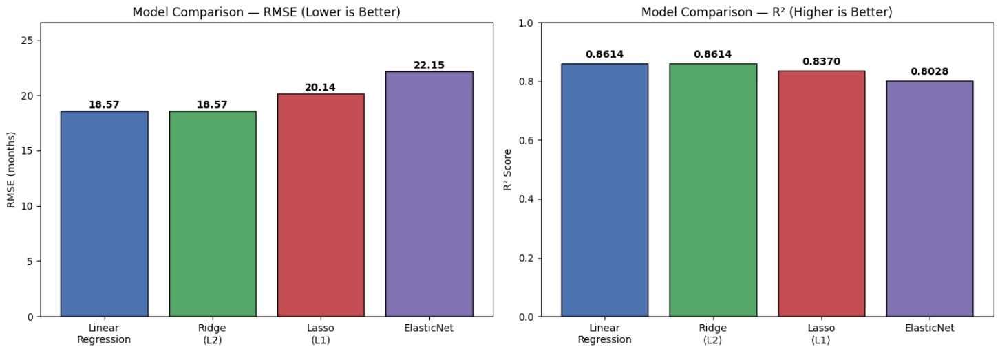
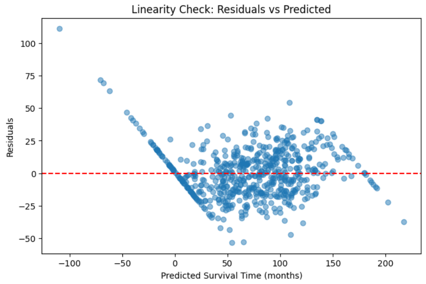
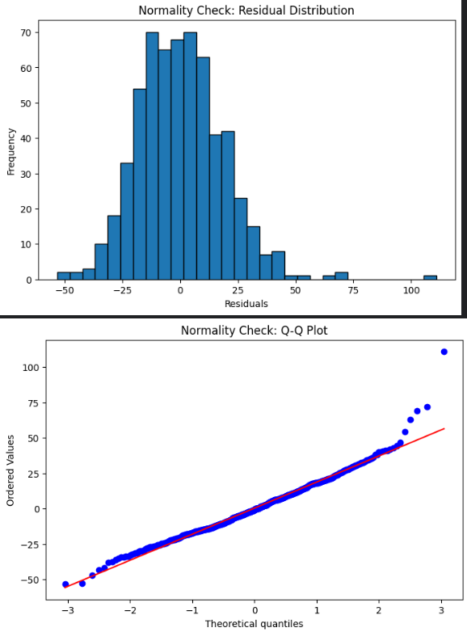
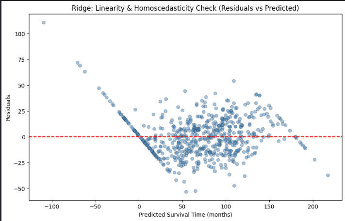
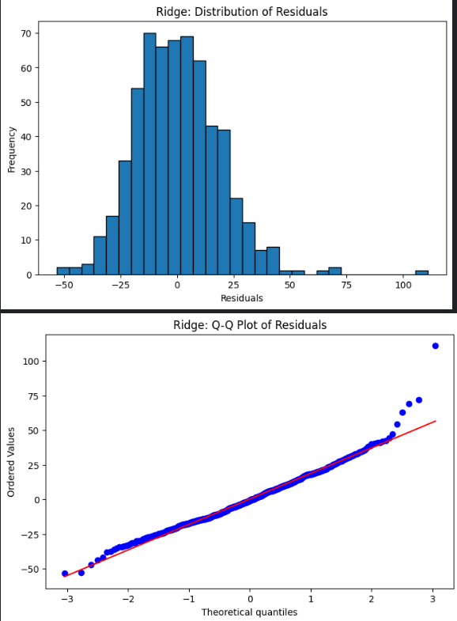

*Objective:-*
The objective of this project is to build a machine learning regression model that predicts the expected Startup Survival Time (in months) based on financial, customer, employee, and business-related features.The project compares multiple regression algorithms, including Multiple Linear Regression, Ridge Regression, Lasso Regression, and Elastic Net Regression, to identify the model that provides the most accurate predictions.

*Input Features & Output column:-*
Funding Stage,
Industry Sector,
Business Model,
Cash Available ($),
Monthly Burn Rate ($/month),
Monthly Revenue ($/month),
CAC ($/customer) — Customer Acquisition Cost,
LTV ($/customer) — Customer Lifetime Value,
Revenue Growth Rate (%),
Customer Churn Rate (%),
Customer Growth Rate (%),
Gross Profit Margin (%),
Employee Attrition (%),
Startup Survival Time (Months)--the output

**Requirements:-**
pandas,
numpy,
scikit-learn,
matplotlib,
scipy,
statsmodels,
seaborn

*Model Comparison Results table:-*
| Model | RMSE | MAE | R² | Adjusted R² |
|---|---|---|---|---|
| Linear Regression | 18.567 | 14.514 | 0.8614 | 0.8536 |
| Ridge (L2) | 18.570 | 14.521 | 0.8614 | 0.8536 |
| Lasso (L1) | 20.138 | 16.093 | 0.8370 | 0.8269 |
| ElasticNet | 22.152 | 17.923 | 0.8028 | 0.7905 | 

*Selecting the best model:-*
Linear Regression and Ridge performed statistically equivalently; both outperformed Lasso and ElasticNet at default regularization strength. Final model: Linear Regression, for its unbiased, directly interpretable coefficients and lack of hyperparameter dependence, with Ridge's equivalent performance serving as confirmation that regularization wasn't necessary for this dataset.

*Top positive and negative predictors:-*
Positive: Funding_Stage_Series C+, Revenue_Growth_Rate
Negative: Customer_Churn_Rate, Employee_Attrition
It helps to understand which features have the strongest positive or negative linear relationship with predicted startup survival time.

*Residual analysis:-*
Residual analysis (or residual diagnostics) is used to check whether your regression model's assumptions are reasonably satisfied and whether the model is making systematic errors. The distribution is following the assumptions as it is approxly normally distributed, but the linearity barely follows. It mainly checks 5 things--
Linearity → Is the relationship reasonably linear?
Homoscedasticity → Is the error spread relatively constant?
Normality of residuals → Are residuals approximately normally distributed?
Outliers → Are there unusually large prediction errors?
Patterns in errors → Is the model missing some important relationship?
As both top models giving the similar metrics score then the Residual analysis also done here , still same results for both the models.
 
 
 
 

*Sample prediction (input → output):-*
A new value of each input features is taken and then the output is predicted. Since, Multiple Linear Regression selected as final model so prediction is done upon that model only to check the output.

**Run it yourself**

git clone https://github.com/tahsinA007/Startup_Longevity_Prediction.git

cd Startup_Longevity_Prediction

pip install -r requirements.txt

jupyter notebook startup-survival-time-prediction1.ipynb
